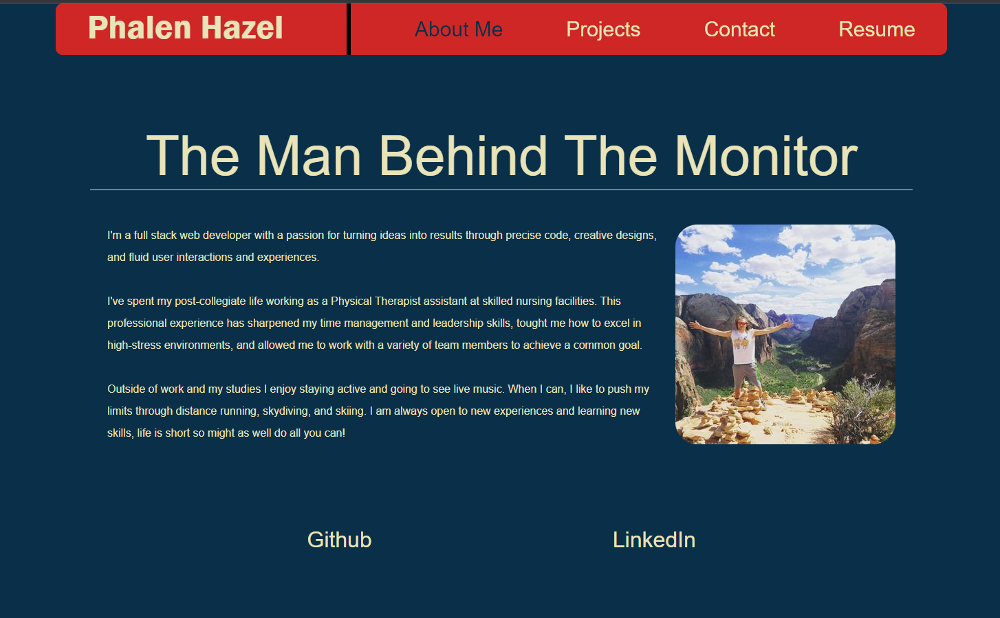

# Phalen Portfolio

## Description

This is the react iteration of my professional portfolio in addition to being my week 20 homework assignment for the fall part time full stack coding bootcamp. I redid my portfolio using react and react components to create a new portfolio with similar style to my original one. It includes a landing page for information about me, a project page with my top 4 projects I've developed during the bootcamp, a contact page for visitors, and a resume page with list of skills and link to my resume.

## Technology Utilized

This portfolio built using react and included css and javascript files to complete the application as well as the use of bootstrap as a framework.
will be based off HTML and CSS files as well as using bootstrap as a framework.

Tools included in this portfolio:

* CSS variables
* flexbox
* Bootstrap

## Objective

The objective is to create a portfolio using React, that highlights my best work as a developer and provides insight to potential employers of the projects that I've worked on in the past and what I'm capable of as a web developer. Cheers!
## Submission

Check out my portfolio here: [Click here to view my portfolio!]( https://phalenh.github.io/react-portfolio/)

